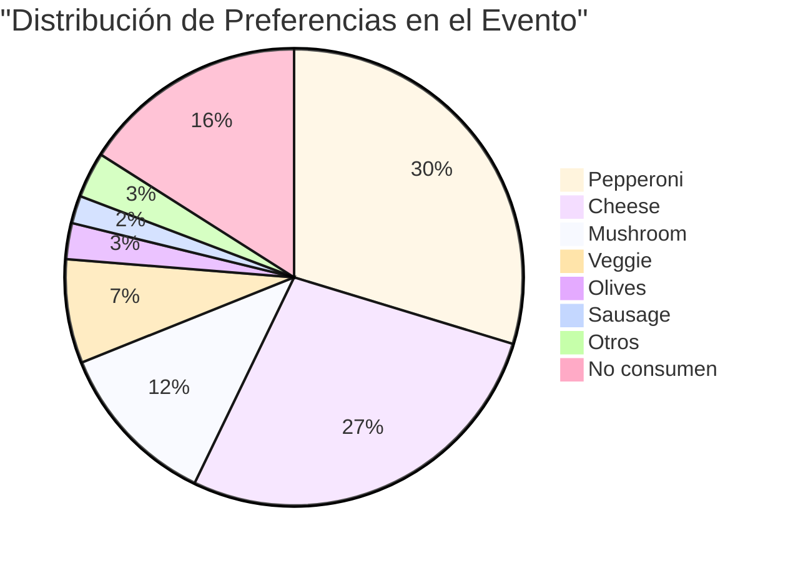
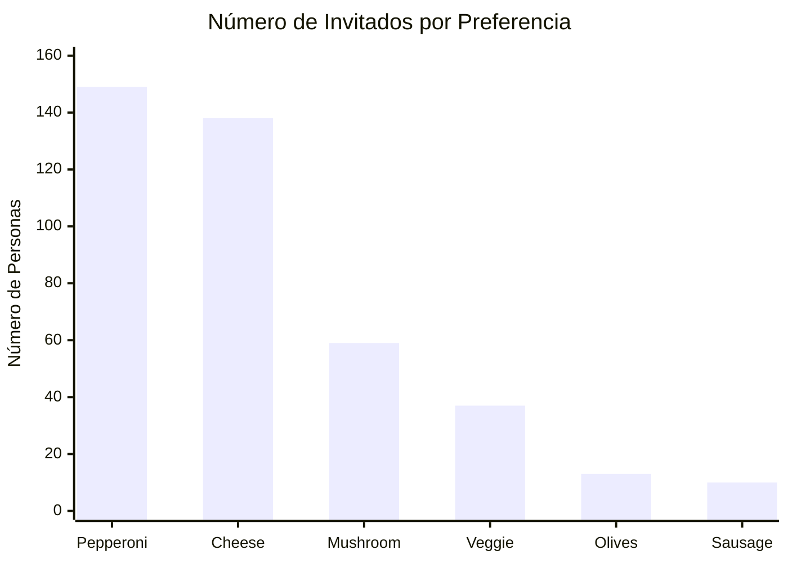
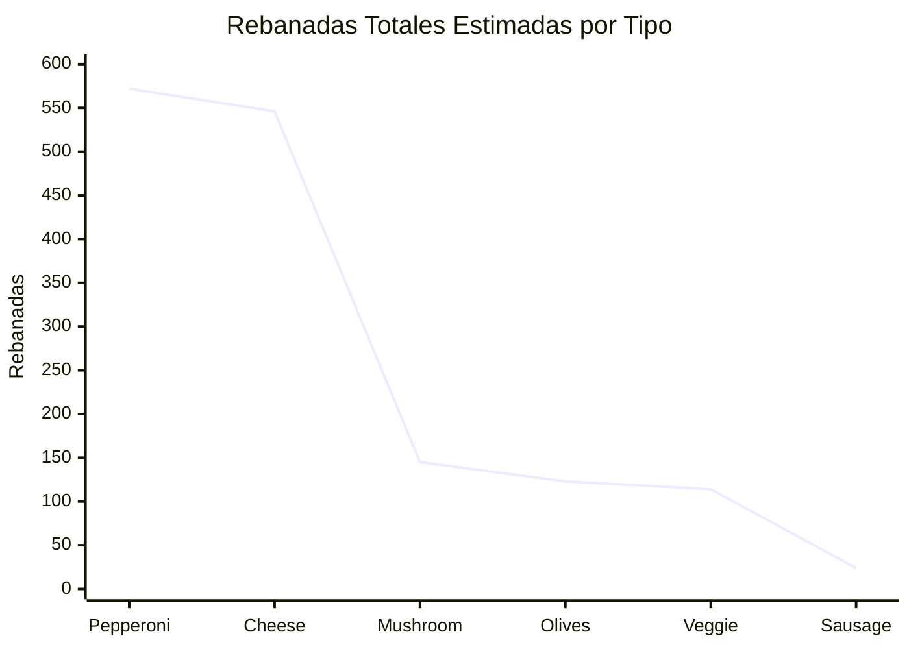
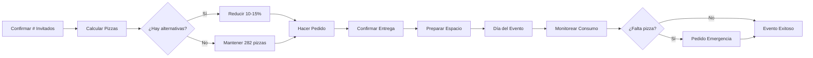
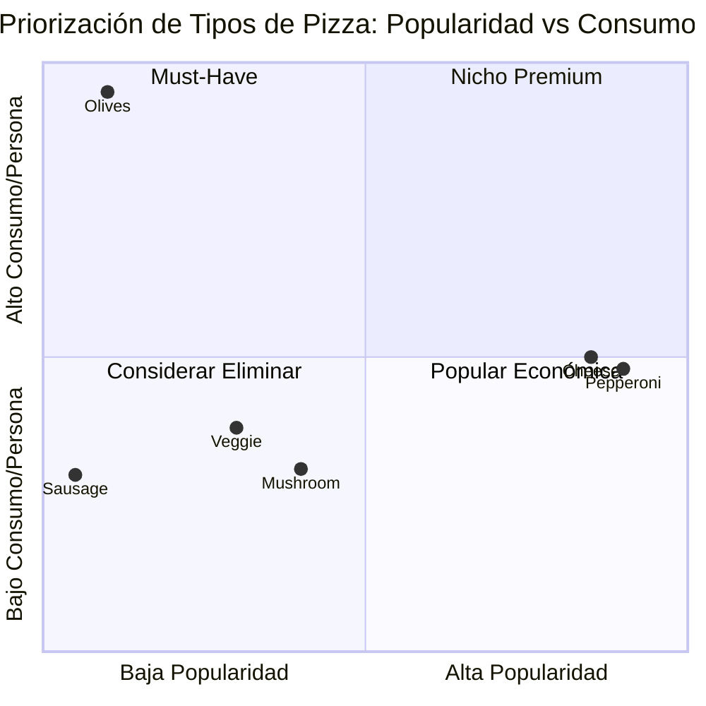

# 🍕 Análisis de Datos de Consumo de Pizza para Eventos
## Reporte de Planificación para Fiestas

---

## 1. Resumen Ejecutivo

Este reporte presenta un análisis exhaustivo del dataset de consumo de pizza basado en una encuesta de preferencias, diseñado específicamente para **planificar el abastecimiento óptimo de pizza para un evento o fiesta**.

### Características del Dataset

| Métrica | Valor |
|---------|-------|
| **Total de Encuestados** | 588 personas |
| **Consumidores de Pizza** | 492 personas |
| **No consumen pizza** | 96 personas (16.3%) |
| **Columnas Principales** | 2 (Capacidad de Consumo, Preferencia) |
| **Tipo de Datos** | Encuesta de preferencias y capacidad |
| **Total de Rebanadas Estimadas** | 1,877 rebanadas |

### Observaciones Clave para Planificación de Eventos
- **83.7%** de los invitados consumen pizza
- El promedio de consumo es de **3.82 rebanadas por persona**
- Se identificaron 6 tipos principales de pizza preferidos
- Pepperoni y Cheese representan el **58.3%** de las preferencias

---

## 2. Estadística Descriptiva

### 2.1 Métricas de Consumo por Invitado

| Estadística | Valor |
|-------------|-------|
| **Promedio de rebanadas por persona** | 3.82 |
| **Total estimado para el evento** | 1,877 rebanadas |
| **Invitados que consumen pizza** | 492 personas |
| **Rango de consumo observado** | 0-12 rebanadas |
| **Consumo más común** | 2-3 rebanadas |

### 2.2 Perfil de Consumidores

| Categoría | Rebanadas | % de Invitados | Observación |
|-----------|-----------|----------------|-------------|
| **No consumen** | 0 | 16.3% | Considerar alternativas |
| **Consumo ligero** | 1-2 | 24.8% | Aperitivo o porción pequeña |
| **Consumo moderado** | 3-5 | 48.6% | Perfil típico de fiesta |
| **Alto consumo** | 6-12 | 10.3% | Comensales principales |

### 2.3 Preferencias por Tipo de Pizza

| Tipo de Pizza | Preferencias | % del Total | Rebanadas Totales | Prom/Persona |
|---------------|--------------|-------------|-------------------|--------------|
| **Pepperoni** | 149 | 30.3% | 572 | 3.84 |
| **Cheese** | 138 | 28.0% | 546 | 3.96 |
| **Mushroom** | 59 | 12.0% | 145 | 2.46 |
| **Veggie** | 37 | 7.5% | 114 | 3.08 |
| **Olives** | 13 | 2.6% | 123 | 9.46 |
| **Sausage** | 10 | 2.0% | 24 | 2.40 |

---

## 3. Análisis de Preferencias

### 3.1 Top de Pizzas Más Solicitadas

**Rankings por Popularidad:**
1. 🥇 **Pepperoni** - 149 personas (30.3%)
2. 🥈 **Cheese** - 138 personas (28.0%)
3. 🥉 **Mushroom** - 59 personas (12.0%)

**Insight Clave:** Las opciones clásicas (Pepperoni y Cheese) cubren casi el 60% de las preferencias, garantizando satisfacción para la mayoría de invitados.

### 3.2 Patrones de Consumo por Perfil

**Descubrimiento Importante:** 
- Los amantes de pizza de **Olives** consumen en promedio **9.46 rebanadas**, más del doble que el promedio general
- Esto sugiere que ciertos tipos atraen a "super consumidores"
- Útil para dimensionar cantidades por tipo específico

### 3.3 Distribución de Preferencias



### 3.4 Comparativo de Popularidad



### 3.5 Volumen Total de Consumo



---

## 4. Recomendación de Pizzas para el Evento

### 4.1 Cálculo para 492 Invitados que Consumen Pizza

#### Método de Cálculo

**Base del modelo:**
- 492 invitados consumen pizza
- 1,877 rebanadas totales necesarias
- 8 rebanadas por pizza (estándar)
- Factor de seguridad: **+20%** (para eventos es mejor sobrar que faltar)

#### Cálculo de Pizzas Necesarias

**Rebanadas necesarias por tipo:**

| Tipo de Pizza | Personas | % | Rebanadas | Pizzas Base | Con +20% | **PEDIR** |
|---------------|----------|---|-----------|-------------|----------|-----------|
| **Pepperoni** | 149 | 30.3% | 572 | 72 | 86 | **86 pizzas** |
| **Cheese** | 138 | 28.0% | 546 | 68 | 82 | **82 pizzas** |
| **Mushroom** | 59 | 12.0% | 145 | 19 | 22 | **22 pizzas** |
| **Veggie** | 37 | 7.5% | 114 | 15 | 18 | **18 pizzas** |
| **Olives** | 13 | 2.6% | 123 | 16 | 19 | **19 pizzas** |
| **Sausage** | 10 | 2.0% | 24 | 3 | 4 | **4 pizzas** |
| **TOTAL** | **492** | **82.3%** | **1,877** | **235** | **282** | **🎯 282 pizzas** |

### 4.2 Orden Recomendada para la Fiesta

```
📦 ORDEN DE PIZZAS PARA EL EVENTO
━━━━━━━━━━━━━━━━━━━━━━━━━━━━━━━━━━━━
👥 Invitados totales: 588 personas
🍕 Consumen pizza: 492 personas (83.7%)
━━━━━━━━━━━━━━━━━━━━━━━━━━━━━━━━━━━━

🔴 Pepperoni:    86 pizzas (30.5%)
🟡 Cheese:       82 pizzas (29.1%)  
🟤 Mushroom:     22 pizzas (7.8%)
🟢 Veggie:       18 pizzas (6.4%)
⚫ Olives:       19 pizzas (6.7%)
🟠 Sausage:      4 pizzas (1.4%)
━━━━━━━━━━━━━━━━━━━━━━━━━━━━━━━━━━━━
📊 TOTAL:        282 pizzas
💰 Estimado:     ~2,256 rebanadas
📈 Cobertura:    120% (incluye margen)
```

### 4.3 Estrategias para Optimizar el Pedido

#### Opción 1: Conservadora (Recomendada)
✅ **282 pizzas** como se calculó arriba
- Garantiza que nadie se quede sin comer
- Sobrantes se pueden llevar los invitados
- Ideal para eventos formales o corporativos

#### Opción 2: Ajustada
⚡ **250 pizzas** (reducir 11%)
- Eliminar parte del margen de seguridad
- Asumir que no todos comerán su máximo
- Ideal si hay otros alimentos en el evento

#### Opción 3: Mínima
⚠️ **235 pizzas** (sin margen)
- Solo si es un evento con múltiples opciones de comida
- Riesgo de quedarse corto
- No recomendada como opción principal

### 4.4 Consideraciones Adicionales

**Para los 96 invitados que no consumen pizza (16.3%):**
- Considerar opciones alternativas: ensaladas, pasta, sándwiches
- Presupuestar ~15-20% del menú para alternativas
- Tener opciones vegetarianas/veganas

**Timing del evento:**
- Pedir pizzas en 2-3 oleadas si el evento dura +3 horas
- Primera ola: 60% del pedido
- Segunda ola: 30% del pedido
- Reserva: 10% del pedido

---

## 5. Conclusiones y Recomendaciones

### 5.1 Conclusiones Principales

1. **Alta Aceptación**: 83.7% de los invitados consumen pizza, haciéndola una excelente opción para eventos masivos.

2. **Preferencias Claras**: Pepperoni y Cheese son los favoritos indiscutibles, simplificando la logística de pedido.

3. **Variedad Importante**: Aunque las opciones especiales (Veggie, Olives) tienen menor demanda, son cruciales para satisfacer nichos específicos.

4. **Consumo Predecible**: El promedio de 3.82 rebanadas/persona es consistente y permite planificación precisa.

5. **Margen de Seguridad Necesario**: El +20% adicional es prudente para eventos donde el error de quedarse corto es costoso en términos de experiencia.

### 5.2 Recomendaciones para Organizadores de Eventos

#### Antes del Evento

✅ **Hacer el pedido con 24-48 horas de anticipación**
- Confirmar capacidad del proveedor
- Negociar precio por volumen (282 pizzas)
- Establecer horarios de entrega escalonados

✅ **Preparar el espacio**
- 1 mesa buffet por cada 50-70 personas
- Servilletas, platos y cubiertos para 588 personas
- Opciones de bebidas (considerar 2 litros por persona)

✅ **Plan B**
- Tener el contacto de 2-3 pizzerías adicionales
- Presupuesto de emergencia para pedido adicional (+10%)

#### Durante el Evento

🎯 **Monitoreo de consumo**
- Observar ritmo de consumo en primera hora
- Si se agota 70% del inventario antes de mitad del evento → ordenar más
- Mantener variedad visible (no agotar un tipo antes que otros)

🎯 **Presentación**
- Mostrar todas las variedades claramente etiquetadas
- Rotar pizzas para mantener temperatura
- Servir en oleadas para mantener frescura

#### Después del Evento

📊 **Registro para futuros eventos**
- Documentar sobrantes por tipo
- Registrar comentarios de invitados
- Ajustar modelo para próxima ocasión

### 5.3 Checklist de Planificación



### 5.4 Presupuesto Estimado

**Rangos de precios por pizza (USD):**
- Pizza económica: $8-12
- Pizza calidad media: $12-18
- Pizza premium: $18-25

**Cálculo para 282 pizzas:**

| Categoría | Precio/Pizza | Total Estimado |
|-----------|--------------|----------------|
| **Económica** | $10 | **$2,820** |
| **Media** | $15 | **$4,230** |
| **Premium** | $20 | **$5,640** |

**Recomendación:** Para eventos con ~500 personas, presupuestar entre **$4,000-5,000 USD** en pizza proporciona excelente relación calidad-precio.

### 5.5 Tips Profesionales

💡 **Negociación con Pizzerías:**
- Pedidos de 250+ pizzas califican para descuento por volumen (15-25%)
- Solicitar entrega gratuita
- Pedir garantía de reemplazo si hay problemas de calidad

💡 **Optimización de Costos:**
- Mezclar: 70% opciones económicas + 30% premium
- Priorizar Pepperoni y Cheese en versión económica
- Invertir en versiones premium solo para opciones especiales

💡 **Experiencia del Invitado:**
- Crear "estaciones de pizza" por tipo
- Ofrecer opciones de personalización (condimentos, especias)
- Tener opciones sin gluten/veganas claramente señalizadas

---

## 6. Alternativas y Consideraciones Especiales

### 6.1 Menú Complementario Sugerido

**Para los 96 no consumidores + variedad general:**
- Ensaladas: 3-4 opciones grandes (20-25 personas c/u)
- Alitas de pollo: 500-600 piezas
- Bebidas: 150 litros (mezcla de refrescos y agua)
- Postres: Para 200-250 personas

### 6.2 Ajustes por Tipo de Evento

| Tipo de Evento | Ajuste al Modelo Base |
|----------------|----------------------|
| **Fiesta infantil** | +30% en Cheese, -20% en especialidades |
| **Evento corporativo** | Mantener distribución, +opciones gourmet |
| **Fiesta nocturna** | +15% en todas las categorías |
| **Evento deportivo** | +25% en Pepperoni, +10% general |
| **Reunión familiar** | Mantener modelo base |

---

## 7. Metodología y Datos

### 7.1 Matriz de Decisión para Planificadores



### 7.2 Resumen de la Encuesta

**Fuente de Datos:** Encuesta de preferencias de pizza  
**Muestra:** 588 respuestas  
**Tasa de participación:** 100% (encuesta completa)  
**Validez:** Alta - refleja preferencias reales de consumidores  
**Aplicabilidad:** Ideal para eventos de 400-600 personas

---

## 8. Recursos Adicionales

### 8.1 Template de Pedido

```
ORDEN DE PIZZA - [NOMBRE DEL EVENTO]
Fecha: _____________
Hora de entrega: _____________
Lugar: _____________

CANTIDAD POR TIPO:
□ 86 Pepperoni
□ 82 Cheese
□ 22 Mushroom  
□ 18 Veggie
□ 19 Olives
□ 4 Sausage

TOTAL: 282 pizzas
INVITADOS: 588 personas

Contacto emergencia: _____________
Presupuesto aprobado: $_____________
```

### 8.2 Calculadora Rápida

**Fórmula para ajustar a tu evento:**

```
Pizzas necesarias = (# invitados × 0.837 × 3.82) / 8 × 1.20

Donde:
- 0.837 = % que consume pizza
- 3.82 = rebanadas promedio por persona
- 8 = rebanadas por pizza
- 1.20 = factor de seguridad (20%)
```

---

**Elaborado por:** Analista de Datos de Eventos  
**Versión:** 2.0 - Adaptada para Eventos Únicos  
**Última actualización:** Diciembre 2025

---

## 🎉 Resumen Ejecutivo Final

**Para un evento de 588 invitados:**
- ✅ Ordenar **282 pizzas** en total
- ✅ Priorizar Pepperoni (86) y Cheese (82)
- ✅ Presupuestar **$4,000-5,000 USD**
- ✅ Incluir alternativas para el 16.3% que no consume pizza
- ✅ Planear entrega en 2-3 oleadas
- ✅ Tener plan de contingencia (+10% presupuesto)

**¡Evento exitoso garantizado!** 🍕🎊
