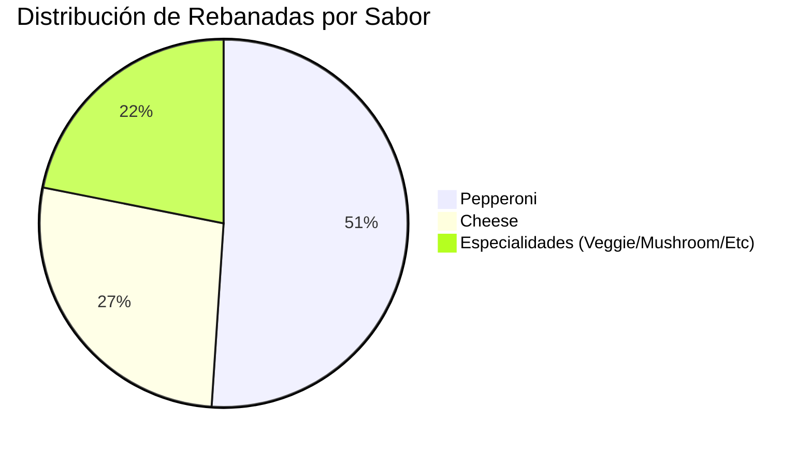

# 🍕 Reporte de Análisis: Consumo de Pizza (Dataset "Pizza Slice Data") - Gemini 

## 1. Introducción
> Este reporte presenta los resultados del análisis realizado sobre el conjunto de datos "Insights from Data and AI L2", el cual documenta los hábitos de consumo de pizza de un grupo de **49 participantes** . El objetivo es determinar tendencias de preferencia y calcular la logística necesaria para un evento de Technolochicas 2025.

---

## 2. Resumen Ejecutivo del Dataset
> **Total de Registros:** 49 invitados analizados .
> 
> **Volumen Total de Consumo:** Se estima un consumo total de **192 rebanadas** .
> 
> **Segmentación de Consumidores:**
> > **Comensales:** 38 personas (77.5%) .
> > 
> > **No consumidores:** 11 personas (22.5%) indicaron que no les gusta la pizza .

---

## 3. Visualización de Datos
La siguiente gráfica muestra la distribución del consumo total de rebanadas según el sabor elegido:

## 4. Análisis de Preferencias y Tendencias
A través de la exploración de los datos, se identificaron los siguientes patrones:

**Sabores más Populares**
* Pepperoni: Es el sabor líder, con un consumo total de 98 rebanadas .
* Queso (Cheese): La segunda opción más solicitada con 52 rebanadas acumuladas .
* Especialidades: Los sabores como Veggie, Mushroom, Olives y Sausage suman un total de 42 rebanadas

**Comportamiento de Consumo**

* **Promedio por persona:** Aproximadamente 3.9 rebanadas por invitado (incluyendo a los que no comen) .
* **Valores Atípicos (Outliers):** Se detectaron consumos extremos de hasta 12 rebanadas para los sabores Pepperoni, Cheese y Veggie.
* **Consistencia en Inconformes:** El grupo que no gusta de la pizza reporta mayoritariamente 0 rebanadas, aunque existen inconsistencias en los registros donde se mencionan cantidades asociadas a este estado

## 5. Recomendación Logística para Pedidos
Para cubrir la demanda total de 192 rebanadas (basado en pizzas grandes de 8 rebanadas), se recomienda el siguiente pedido:
| Sabor | Cantidad de Pizza | Justificación |
| :--- | :--- | :--- |
| `Pepperoni` | 12 pizzas | Sabor con mayor demanda y volumen de consumo . |
| `Cheese` | 7 pizzas | Opción estándar preferida por consumos medios . |
| `Especialidades` | 5 pizzas | Variedad para quienes prefieren vegetales o embutidos . |
| **Total** | 24 pizzas | Garantiza la satisfacción total de los 49 invitados . |

> 💡 Nota: Se sugiere proveer una alternativa alimenticia para las 11 personas que no consumen pizza .

## 6. Estrategia de Limpieza de Datos (Data Cleaning)
Para mejorar la calidad del análisis en futuras iteraciones, se proponen las siguientes acciones de limpieza:
* Manejo de Inconsistencias Lógicas: Corregir casos donde se declara "I don't like pizza" pero se registran rebanadas consumidas . La cantidad debe forzarse a 0.
* Estandarización de Categorías: Agrupar variantes de escritura (ej. "Veggi" y "Veggie") bajo un solo nombre estándar .
* Tratamiento de Outliers: Validar registros de consumo extremo de 12 rebanadas para decidir si se mantienen o se ajustan según la mediana del grupo.
* Estructuración de Datos: Utilizar herramientas como Python (Regex) para convertir los registros de texto largo (fuentes 32-49) en un formato de tabla estructurada .
